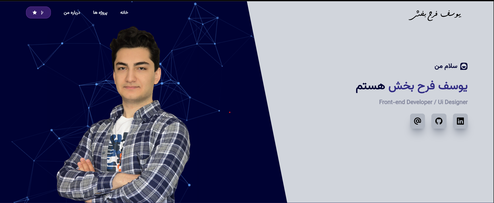

# Portfolio React

A personal portfolio website built with React and Vite to present your skills, projects, and front-end UI work.

## Tech Stack

- React
- Vite
- Tailwind CSS
- React Router
- Swiper
- React Icons

## Getting Started

1. Install dependencies:

```bash
npm install
```

2. Start the development server:

```bash
npm run dev
```

3. Build for production:

```bash
npm run build
```

## Optional Personal Hero Image

If you want your own photo to appear on the Home page, place this file in:

```text
public/About-image1.jpg
```

That file is ignored by git, and the app now shows a fallback card automatically when the image does not exist.

## Website Preview

You can add a screenshot of your portfolio website in:

```text
public/website-preview.png
```

When you are ready, add this line to the README wherever you want the preview to appear:





## Features

- Responsive portfolio layout for mobile and desktop
- Project showcase section with room for GitHub and live links
- Animated UI sections and interactive styling
- Optional personal image support without breaking the app for other users
